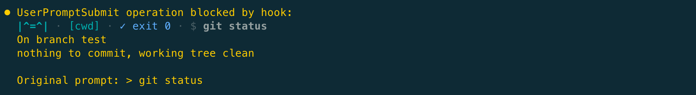
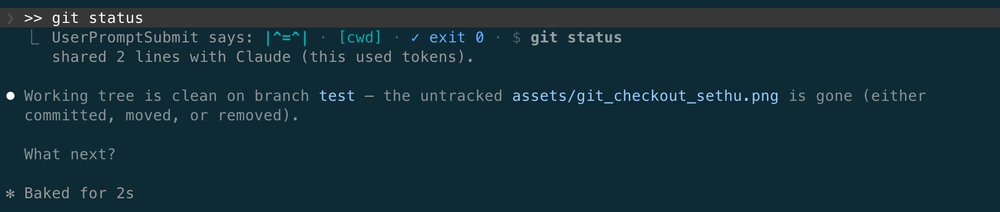
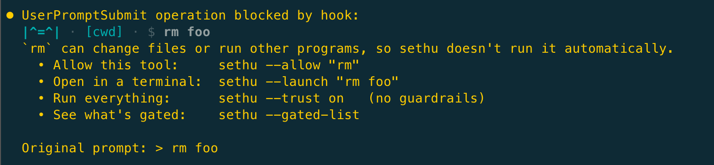

#  sethu: a bridge between Claude Code's prompt box and your shell

*The name sethu is Sanskrit for "bridge", a word shared across Indian languages.*

### ⚠️ The problem

Every terminal command you ask Claude to run dumps its output into the context window. That
**costs tokens**, **clutters the conversation**, and fills your context faster (so
auto-compaction hits sooner). Switching to a separate terminal breaks your flow.

###  What does sethu do?

Run terminal commands **right in the Claude Code prompt box**. Type a command with a `>`
prefix as an ordinary message, and a `UserPromptSubmit` hook runs it locally and blocks the
prompt, so **you see the output for free and the model never sees it**. Use `>>` instead
when you *do* want Claude to see the result and act on it.

```text
> grep -n TODO src/   # runs it, shows YOU the output (zero tokens, model never sees it)
>> grep -n TODO src/  # runs it AND sends the output to Claude (costs tokens, on purpose)
sethu --allow git     # opt a whole tool in (git/find/npm/…); safe tools like grep/ls/cat run already
> git status          # now runs (git was allowed above)
```

Every result is tagged with the little  bridge, so sethu's output is easy to spot.

`> git status` shows you the result, for free (the model never sees it):



Add a second `>`: `>> git status` runs the same command but sends the output to Claude, so it can act on it (that part costs tokens):



---

## ⚡ Why sethu?

- **💸 Save tokens.** Glance at `> git status`, `> git diff`, `> ls`, or
  `> cat config.json` as often as you like, all for free. The output stays out of
  the context window, so Claude stays sharp longer and big sessions stay cheaper.
- **🎯 You control what Claude sees.** `>` keeps output private to you, while `>>`
  feeds it in only when you want Claude to act on it. No more dumping noise into
  the conversation.
- **🐚 A shell in the chat.** `sethu --mode shell` gives you a persistent shell:
  `cd`, `export`, activate a venv, then run commands that share that state,
  without leaving the Claude window.
- **🛡️ Safe by default.** **Gated** out of the box: a curated set of safe inspection
  tools (`ls`, `cat`, `grep`, `jq`, …) just works, while everything else is refused
  until you `--allow` that tool (or `--trust on` for everything).
- **🪶 No package installs.** Pure Python standard library: no `pip`, no npm, no
  third-party packages to manage. (It just needs `python3`, see [Install](#-install).)

> **sethu vs. `!` bang mode:** `!` is Claude Code's built-in shell shortcut, and it
> always feeds output to Claude, so it always costs tokens. sethu's edge is the **free, out-of-context `>`**, plus a
> persistent shell and allowlist guardrails. If you always want Claude to act on
> the output, `!` is fine. If you want to look at things for free, use `>`.

---

## 📦 Install

Inside a Claude Code session:

```
/plugin marketplace add NamrataAShettar/claude-sethu
/plugin install sethu
/reload-plugins
```

That's it. Gated tools like `> ls` / `> grep` work immediately (`sethu --gated-list` shows the whole set). For anything else
(git, find, npm, …), allow the tool once: `sethu --allow git`. (Manage sethu right in the
prompt box: type bare `sethu` for the menu, no terminal setup needed.)

**Needs** [Claude Code](https://claude.com/claude-code) and **Python 3.9+** (`python3 --version`).

<details>
<summary><b>🐍 Installing python3, and OS support</b></summary>

- Most Linux distros already include python3. macOS often doesn't: install via
  [Homebrew](https://brew.sh) (`brew install python`), the Xcode Command Line Tools
  (`xcode-select --install`), or [python.org](https://www.python.org/downloads/). If it's
  missing, sethu tells you at session start and goes quiet, so your prompts still work.
- The plain `>` / `cwd` / `stateless` runner works everywhere. Shell mode and `--launch`
  are the only OS-sensitive parts:
  - **macOS:** both work.
  - **Linux:** shell mode works. `--launch` needs `tmux` (no native Linux-terminal support
    yet). Without tmux, run the command in your own terminal.
  - **Windows:** use **WSL** (shell mode works there). `--launch` needs `tmux`.

</details>

<details>
<summary><b>🔄 Keeping sethu up to date</b></summary>

sethu installs from its own marketplace, which (like all non-official marketplaces) doesn't
auto-update by default. Two ways to stay current:

- **Auto (recommended):** `/plugin` → **Marketplaces** → **sethu** → **Enable auto-update**.
  Claude Code then updates sethu at session start.
- **By hand, anytime:** `/plugin marketplace update sethu`, then `/plugin update sethu`.

</details>

---

## 📋 Cheat sheet

Type these as normal messages (no `!`). Bare `sethu` shows the full menu. Flag and
subcommand styles both work (`sethu --mode shell` ≡ `sethu mode shell`).

| You type | What happens |
| --- | --- |
| `> cmd` | run it, show **you** the output (free) |
| `>> cmd` | run it and **send output to Claude** (costs tokens) |
| `sethu --allow "tool"` | permit a whole tool, any flags (`git`, `find`, `npm`, …); gated ones already run |
| `sethu --unallow "tool"` | remove a tool from the allowlist |
| `sethu --launch "cmd"` | open `cmd` in a real terminal now, one-shot (for `vim`, `top`, `ssh`, a REPL, `tail -f`, …) |
| `sethu --gated-list` | tools that run without asking (built-in + ones you allowed) |
| `sethu --trust on` | ⚠ run **anything**, gate off (no guardrails) |
| `sethu --mode stateless\|cwd\|shell` | switch statefulness (default `cwd`; `shell` makes `cd`/`export`/venv stick, see [below](#-statefulness-modes)) |
| `sethu --rc on` | in `shell` mode, load your shell aliases/functions/env |
| `sethu --plain on` | `sethu:` prefix + words instead of `\|^=^\|`/glyphs (screen readers) |
| `sethu --restart` | restart the persistent shell (clears shell-mode state) |
| `sethu --timeout 60` | give commands up to 60s |
| `sethu --runner` | show the current config (with defaults) |

Config lives in `~/.claude/sethu.json`. The full `sethu` menu has a few more knobs:
`--prefix` (change the `>` trigger), `--color`, and `--maxlines`.

> 💡 **Want ideas?** See **[docs/use-cases.md](docs/use-cases.md)** for a full,
> copy-paste catalog covering git, file and log inspection, build and test,
> persistent-shell workflows, quick lookups, and more, with the exact commands
> for each.

---

## 🔀 Statefulness modes

`sethu --mode <mode>` picks how much state persists between commands:

| Mode | `cd` sticks | `export`/venv sticks | Notes |
| --- | :---: | :---: | --- |
| `stateless` | ❌ | ❌ | fresh `sh -c` subprocess each time |
| `cwd` *(default)* | ✅ | ❌ | working dir remembered in a temp file |
| `shell` | ✅ | ✅ | one persistent `bash` (PTY daemon), reused |

**Notes:**

- By default, `>` runs in your Claude Code session's working directory (the folder
  you launched Claude in).
- `shell` mode keeps a long-lived bash so `cd`, env vars, `source`, and venvs carry
  across commands. It idles out after 30 min, and `sethu --restart` clears it on demand.
- `shell` mode runs a clean `bash --norc` by default. Turn on `sethu --rc on` to source
  your `~/.zshrc` / `~/.bashrc` so your aliases and functions work.
- `export`, `alias`, and similar state builtins only take effect in `shell` mode, the
  only mode that keeps state between commands.

---

## 🛡️ Safety

- **Gated by default.** Tools that can't write files or run other programs, whatever
  the flags (`ls`, `cat`, `grep`, `jq`, …), run automatically. Anything that *can*
  (`git`, `find`, `npm`, …) waits for `sethu --allow`. sethu judges the whole tool, not
  individual flags, so a tool is allowed entirely or not at all.

  When a command isn't gated, the refusal tells you *why* and hands you the ways forward:

  
- **A guardrail, not a sandbox.** You can always bypass it: your own terminal, or
  widening the gate with `--allow` or `--trust`. (In **shell mode**, an alias or `PATH`
  you set sticks, so a later command runs whatever you redefined it to, exactly like a
  normal shell.)
- **Runs in your shell, no per-command prompts.** sethu executes commands directly,
  with no Claude Code "allow this?" popup, so keep the allowlist tight, like shell
  aliases. Allowing a tool that can run other programs (`git`, `sh`, `python`, …)
  permits *all* of its flags, and sethu warns you when you do.
- **Injection-hardened.** You can't chain a second command onto an allowed or gated
  one: no unquoted `;`, `&&`, redirect (`>`), background `&`, or `$(…)`. Allowing `ls`
  does **not** allow `> ls; rm -rf ~`. Pipes run only when *every* tool in them is gated
  (`> cat f | grep x` works; `> ls | rm` is refused). Characters inside quotes are
  literal, so once `python3` is allowed, `> python3 -c "import os; print(1)"` works.
- **Trust is the one safety knob.** `sethu --trust on` turns the gate off and runs
  anything with no guardrails at all. Off by default (= gated), warned loudly, shown as
  `⚠trust` while active.

---

## 🚧 When sethu *won't* work? (the honest limits)

sethu is a hook, and hooks have boundaries. Here's where it can't help, and what
to do instead:

| Situation | Why? | Do this instead |
| --- | --- | --- |
| **Claude is still generating** ("pondering") | The hook only fires on a prompt that *starts* a turn. A `> cmd` typed mid-turn is queued and read by the **model** (costs tokens), not run by sethu. | Send `> cmd` when Claude is idle, or run things in a separate terminal / `sethu --launch <shell>`. |
| **Interactive programs** (`vim`, `top`, `ssh`, a bare REPL) | The runner has no terminal, so they'd hang. | `sethu --launch "vim"` opens a real pane (macOS or tmux; on plain Linux/WSL, run it in your own terminal). |
| **Commands that prompt for input** (`npm install` conflicts, `apt install` "[Y/n]", `gh auth login`) | Even shell mode can't *type back* at a prompt. | Use non-interactive flags (`-y`, `--yes`, `DEBIAN_FRONTEND=noninteractive`) or `--launch`. |
| **Long-running commands** (servers, `tail -f`) | Capped at 20s (`sethu --timeout` to raise, but the hook budget is ~30s). | Run them in a launched pane. |
| **Different modes in two sessions at once** | Settings (mode, allowlist, trust) live in one shared config, so `sethu --mode` and `--allow` apply to **all** your sessions. (Working dir and the `shell` bash stay per-session.) | Set the mode you need for now; you can't run one session in `shell` and another in `cwd` simultaneously. |
| **Windows (native)** | Shell mode needs Unix sockets/PTYs; `--launch` needs macOS or tmux. | Use WSL (with `tmux` for `--launch`). |
| **`--launch` on plain Linux / WSL (no tmux)** | sethu can't open a terminal window there yet (no native Linux-terminal support), so `--launch` won't work. | Start `tmux` first (then `--launch` splits a pane), or just run the command in your own terminal. |
| **`--allow`-ed git in an untrusted repo** | After `--allow git`, commands like `> git status` can run programs named in the repo's own `.git/config` (`core.fsmonitor`, `diff.external`, …). That's git's normal behavior, same as in your terminal. | Don't run git in a repo you don't trust; git's `safe.directory` only guards other-owner repos. |

> A **launched** terminal (`--launch`) is a *plain shell*. It does **not** share
> sethu's allowlist, mode, or cwd. It's an escape hatch out of sethu for
> interactive or long-running programs, not a safer runner.

---

## 🛟 Troubleshooting

- **"UserPromptSubmit operation blocked by hook:" appears before my output**: Normal, and
  it means it worked. Claude Code wraps that around any prompt a hook handles locally, which
  is how sethu keeps your command out of the model. Your real result is the
  `|^=^| [mode] ✓ exit 0` line below it.
- **I typed `> cmd` but nothing ran (or Claude answered it instead)**: you typed it
  while Claude was still generating. sethu only fires on a prompt that *starts* a turn,
  so a `>` typed mid-response is read by the model (and costs tokens), not run by sethu.
  Send `> cmd` when Claude is idle.
- **"`X` can change files or run other programs, so sethu doesn't run it automatically."**: sethu is gated by default, and the message says why
  (e.g. `git`/`npm` can write or run other programs). Permit it with `sethu --allow X`
  (the whole tool). If it's interactive (`vim`, a bare REPL), use `sethu --launch "X"`
  instead, since allowlisting can't make those run. `sethu --trust on` drops all guardrails,
  so prefer allowlisting the specific tools you need.
- **"timed out after 20s."**: captured commands are capped under Claude Code's ~30s hook
  budget. Raise it with `sethu --timeout`, or run long-lived commands (servers, `tail -f`)
  in a real terminal with `sethu --launch`.
- **Nothing happens at all (or a "sethu needs python3" note at session start)**: sethu's
  hooks run on `python3`. If it isn't on your `PATH`, sethu goes inactive (your prompts
  still work normally). Install python3 (see [Install](#-install)), then `/reload-plugins`.

Still stuck? [Open an issue](https://github.com/NamrataAShettar/claude-sethu/issues).

---

## 🤝 Coexisting with other hooks

sethu is a well-behaved `UserPromptSubmit` hook, and it installs cleanly alongside
your others (hooks run **in parallel**, with no ordering dependence):

- **Normal prompts** (not `>` / `>>` / `sethu`) pass straight through: sethu does
  **nothing**, so your other hooks run exactly as they would without it.
- **`>> cmd`** injects output as `additionalContext`, which Claude Code
  **concatenates** with any other hook's context, so they stack rather than clash.
- **`> cmd` / `sethu …`** blocks that one prompt (its purpose). Other hooks still
  run their side effects, but the model doesn't (as intended).

One overlap to know about: another `UserPromptSubmit` hook that *also* acts on
`>`-prefixed prompts. If both block the same prompt, it stays blocked (fine), but Claude
Code doesn't document how two block *reasons* combine, so the shown result may merge them.
Rare in practice, since sethu only claims the `>` prefix.

---

## 🧩 Extras

<details>
<summary>Accessibility (screen readers, plain terminals)</summary>

The header is colorblind-safe (blue for success, not green/red) and never color-only.
Status, mode, and warnings are always words, so a screen reader gets the full meaning,
and `NO_COLOR` drops color entirely. For readers, **`sethu --plain on`** (or
`SETHU_PLAIN`) swaps the `|^=^|` icon and
`·✓✗⚠→` glyphs for a plain `sethu:` prefix + comma-separated words (e.g. `sethu: [cwd],
exit 0, $ git status`), also a fallback for terminals without good Unicode.
</details>

<details>
<summary>Long output &amp; temp files</summary>

Big output (`ps aux`, `ls -R`) is capped at **40 lines** inline (`sethu --maxlines`
to change; `0` = unlimited). The full text is saved to a per-session file and a
note points at it, so you can open it, or `sethu --launch "less <path>"` to scroll
it.

Storage stays bounded: the saved file is **reused per session** (one at a time),
and sethu sweeps its own temp files (saved output, launch scripts, shell-mode
sockets) once they're older than 7 days.
</details>

<details>
<summary>Running scripts vs. REPLs</summary>

An interpreter *with a script* runs and exits, so it works captured:

```
sethu --allow python3
> python3 build/report.py     # runs, output captured, zero tokens
> python3 -c "print(2**10)"   # -c / -m are batch too
> python3                     # bare REPL, refused (use --launch)
```

`python`/`node`/`irb`/`ipython` count as interactive only when launched bare or
with `-i`. Give them a script path, `-c`, or `-m` and they run the code straight
through and exit, so sethu captures the output fine.
</details>

---

## 💬 Feedback & feature requests

sethu is actively developed and **your input shapes it.** If you find a rough
edge, hit a case that didn't work, or want a feature (a `--console` shared pane?
another mode?), please
**[open an issue](https://github.com/NamrataAShettar/claude-sethu/issues)**. Bug
reports, ideas, and "this was confusing" notes are all genuinely welcome.

---

## 🧪 Tests

Stdlib only, no dependencies:

```bash
python3 -m unittest discover -s tests -v
```

The suite covers the allowlist, gated safety (injection and chaining refused),
the interactive guard, all three modes (including the persistent shell), the `>>`
pipe, and config round-trips. Every feature and CLI argument maps to a test (a
coverage table at the top of `tests/test_sethu.py`, guarded by a meta-test that
fails if any argument is untested). CI runs them on every push and PR.

See **[docs/testing.md](docs/testing.md)** for how to exercise a behavior directly
and how to test a feature branch live in Claude Code before merging,
**[docs/design-guidelines.md](docs/design-guidelines.md)** for the UX / correctness
/ security / performance / storage principles every change is checked against, and
**[docs/versioning.md](docs/versioning.md)** for what the version number means and how
to title your PR (the title drives the automated version bump).

---

## ℹ️ About Claude Code

sethu is a plugin for **[Claude Code](https://claude.com/claude-code)**,
Anthropic's official CLI for Claude, built entirely from its extension points (a
`UserPromptSubmit` hook for `>`/`>>`, and a `SessionStart` hook for the first-run
hint). Docs: [Claude Code](https://claude.com/claude-code) ·
[Plugins](https://code.claude.com/docs/en/plugins) ·
[Hooks](https://code.claude.com/docs/en/hooks).

---

## License

MIT
</content>
